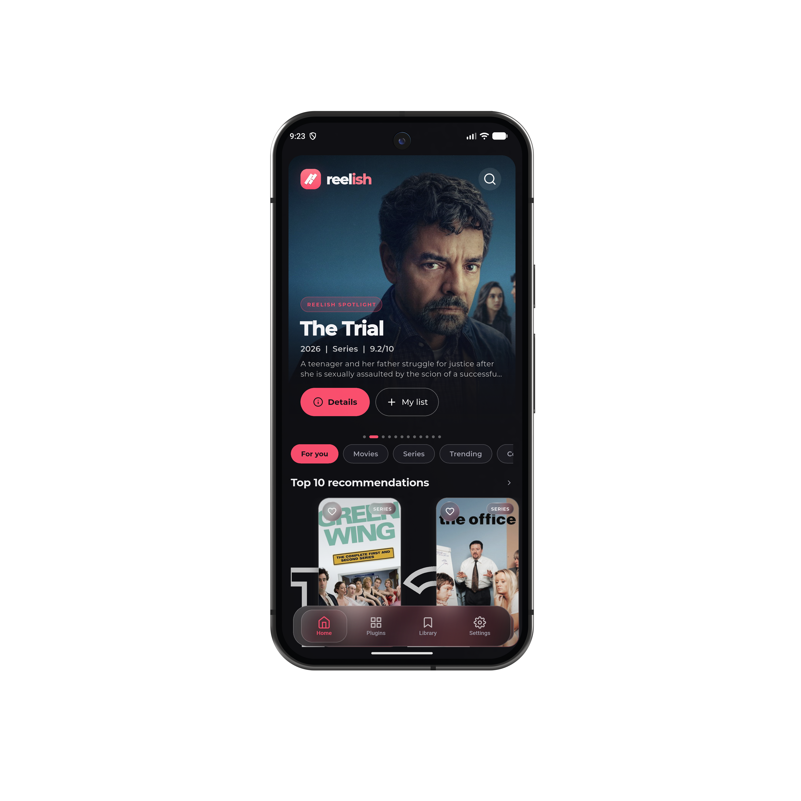
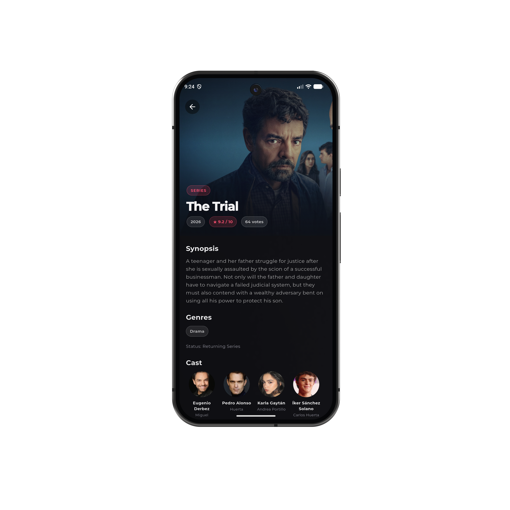
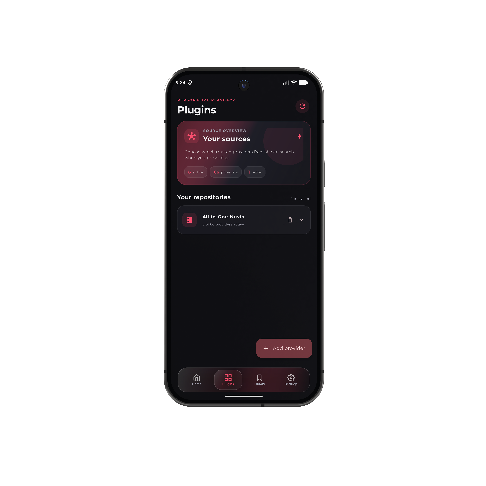
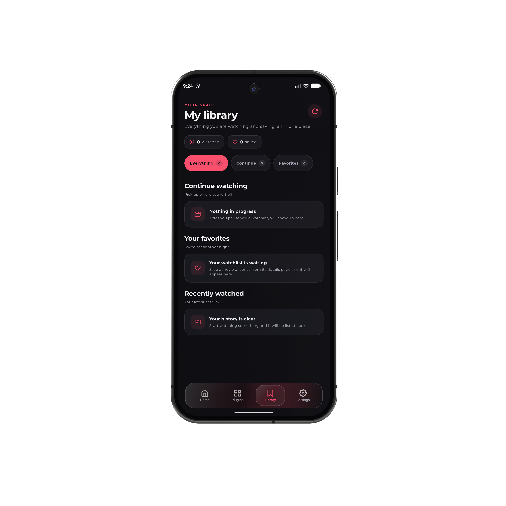

# Reelish

[](https://github.com/frnzeeey/reelish)

Reelish is an open-source Flutter app for discovering movies and TV series and watching them with providers you choose. Browse TMDB-powered catalogs, find a title, search enabled providers for streams, and play a source in the built-in player. Reelish was previously named Onfeed in parts of the codebase.

## Features

- Browse popular and trending movies and series, search titles, and view recommendations, new releases, and title details.
- Keep a local library of favorites, recently watched titles, and playback progress so you can continue where you left off.
- Install Nuvio provider repositories, enable the providers you want, and choose which providers can be used for playback.
- Play supported direct streams, with source selection, resume progress, playback controls, and configurable subtitles.
- On Android, allow compatible providers to return torrent sources for P2P playback.
- Choose an accent color and customize playback, subtitle appearance, language preferences, and gestures.
- Read the privacy policy, terms of use, and third-party credits in the app.

## Images

| Home | Title details |
|:---:|:---:|
|  |  |

| Provider plugins | Personal library |
|:---:|:---:|
|  |  |

## Providers

Open **Plugins** and add a Nuvio provider manifest URL (or a supported GitHub repository/file link). Review the repository's providers, then enable the ones you want. Provider repositories and enabled-provider choices are saved on the device. Reelish runs provider scripts in a constrained JavaScript runtime and requests streams when you open a title; providers do not populate the catalog.

Providers are third-party code and services. Install repositories only from publishers you trust. Reelish does not supply or host streams. Provider availability and compatibility depend on each provider and its sources.

## Playback and subtitles

Choose a source from the title's stream list to start playback. Reelish supports direct HTTP(S) streams accepted by the platform player. Android also supports compatible torrent/P2P sources returned by providers; this depends on the provider and torrent source. Other platforms do not offer Reelish's torrent playback.

The player supports external SRT and WebVTT subtitles, with language selection and display settings. Reelish can search OpenSubtitles for subtitles. Stream and subtitle availability, formats, and behavior vary by source and platform.

## TMDB configuration

Reelish uses [The Movie Database (TMDB)](https://www.themoviedb.org/) for catalog data, search, artwork, and title details. A TMDB API key is required to run the app. Create the ignored local file `lib/tmdb_config.local.dart` with:

```dart
const tmdbApiKey = 'YOUR_TMDB_API_KEY';
```

The key is included in client builds, so treat it as a public API key and apply appropriate restrictions in your TMDB account. This product uses the TMDB API but is not endorsed or certified by TMDB. Credits and third-party notices are available in Reelish under **Settings > Credits**.

## Run from source

Install Flutter for your target platform, configure the TMDB key as described above, then run:

```sh
flutter pub get
flutter run
```

## Android releases

Release builds are published on [GitHub Releases](https://github.com/frnzeeey/reelish/releases). Android can check for a newer stable release and offer to download its APK; installation is confirmed through Android's package installer. See [docs/releasing.md](docs/releasing.md) for how releases are made.

## Privacy and terms

On first launch, read and accept the privacy policy and terms of use shown in the app. Favorites, playback history, settings, and provider choices are stored locally. TMDB, provider publishers, stream hosts, and subtitle services receive requests needed for the features you use; Android may contact GitHub for update checks. See the in-app **Privacy policy** and **Terms of use** for details.
